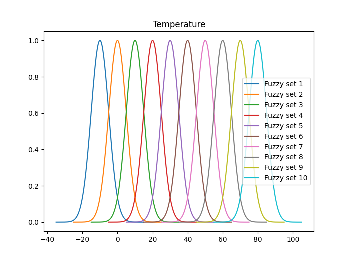
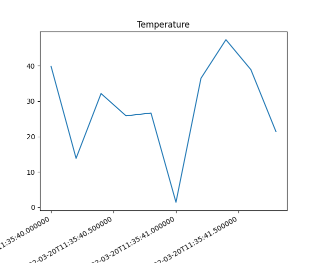
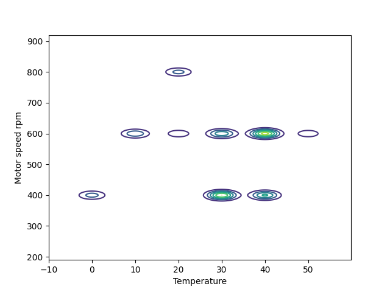
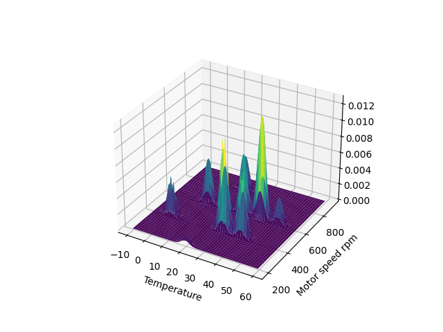
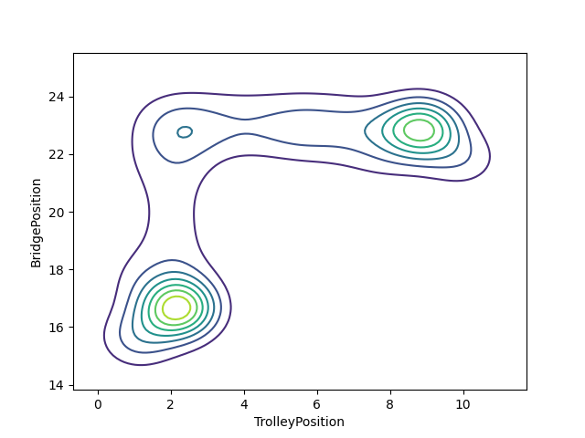
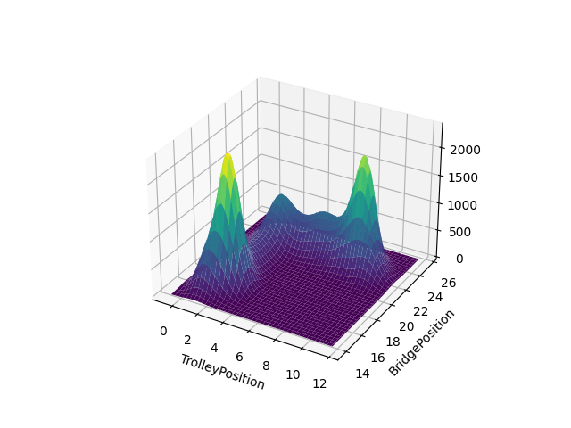

# Futimo
Futimo, <ins>fu</ins>zzy <ins>ti</ins>me-series data <ins>mo</ins>deling method for modeling industrial time-series data.

## Description
This project contains scripts that allow data modeling using Futimo method. The method is implemented based on Tuomas Keski-Heikkilä's master's [thesis](http://urn.fi/URN:NBN:fi:aalto-202109059012).
A journal article of the method is currently under writing.

## Installation
For running this project Python 3 is required. Install the required packages by running 

    pip3 install -r requirements.txt

## Usage
You can generate test data using [generate_test_data.py](generate_test_data.py). At the beginning of the script there are several parameters that can be used to modify the data. You can also use [test_data_descriptions.txt](examples/test_data_descriptions.txt) to modify the gaussian functions used to generate data.

    python3 generate_test_data.py

After that you can run [fuzzy_modeling.py](fuzzy_modeling.py) to fuzzify data and write it into database using the method desribed in [Placeholder for article].

    python3 fuzzy_modeling.py

By default, this script also visualizes the fuzzy sets used for fuzzification.

In addition, it plots the raw data.

If you want to visualize data stored in database, run first [expand_fuzzy_sets_for_visualization.py](expand_fuzzy_sets_for_visualization.py). This also aggregates data in database using the variables selected in the beginning of the file.

    python3 expand_fuzzy_sets_for_visualization.py

Then you can run script [data_visualization.py](data_visualization.py) that produces visulization based on fuzzified data. This is illustarted below for the created test data.

    python3 data_visualization.py

The variables to be visualized can be given as arguments:

    python3 data_visualization.py -m "Temperature" "Motor speed rpm"

See [Documentation](Documentation.md) for more accurate descriptions of the contents of this repository. In addition, if there are issues you can check [Problems?](Documentation.md#problems).

### Use of crane dataset

We have collected a industrial crane dataset that is available in [Zenodo](https://doi.org/10.5281/zenodo.6907569).
The more accurate description of tha data set is also available in Zenodo.

The root of dataset folder contains `combined_csv.csv` file that includes the most relevant variables from all cycles.
In addition, it is possible to examine each test cycle separately from Raw data -> CycleX. Each test cycle folder contain `CycleX_export_dataframe.csv` that includes the most relevant variables, and is good starting point for examinine data.

To model data in `combined_csv.csv` or `CycleX_export_dataframe.csv` files, the following modifications needs to be made to `fuzzy_modeling.py`:

Change the fuzzy set description file to `fuzzy_sets_crane.txt`

    FILE_NAME_FUZZY_SETS = "examples/fuzzy_sets_crane.txt"

Then set input file name to the csv file you want to model (in this case, it is assumed that the file is located to the same folder as `fuzzy_modeling.py` file):

    FILE_NAME_TEST_DATA = "combined_csv.csv"

Change csv delimiter to `,`:

    CSV_DELIMITER = ","

Change date format to OPC UA (note: the timestamps in the data are incorrect, as the OPC UA server was showing year 2103):

    DATE_TYPE = Date_type.OPC_UA

You can change the table name in database:

    TABLE_NAME = "crane_data"

Finally, change the number of variables to 13.

    NUMBER_OF_VARIABLES = 13

Then run:

    python3 fuzzy_modeling.py

If you want to visualize crane data, you need to run `expand_fuzzy_sets_for_visualization.py`.
From that file you can modify the variables that you want aggregate:

    LIST_OF_AGGREGATED_VARIABLES = ["BridgePosition", "LoadTare", "HoistPosition", "TrolleyPosition"]

or then you can select all variables:

    USE_ALL_VARIABLES = True

Remember also to change:

Fuzzy sets description file to `fuzzy_sets_crane.txt`

    FILE_NAME_FUZZY_SETS = "examples/fuzzy_sets_crane.txt"

Table name to match tablename in database:

    TABLE_NAME = "crane_data"

Finally, run:

    python3 expand_fuzzy_sets_for_visualization.py

After this you can use `data_visualizaton.py` to visualize data. Remember to give the variables you want to visualize as arguments:

    python3 data_visualization.py -m TrolleyPosition BridgePosition

After running this script using aggregation of all variables and combined_csv.csv as an input, you should get the following visualizations.

## Authors and acknowledgment
* Riku Ala-Laurinaho
* Julius Pesonen

The authors would like to thank Tuomas Keski-Heikkilä, Miika Valtonen and Juuso Autiosalo for their support.
The authors would like to thank Joel Mattila for testing the scripts.
The authors would like to express their sincere gratitude to Innovaatiosäätiö.

## License
MIT

## Project status
First working version is published.
