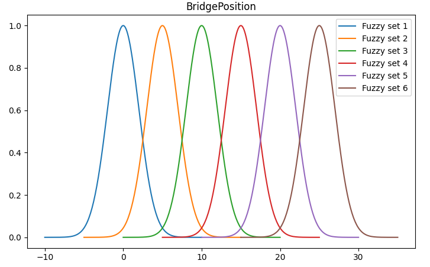
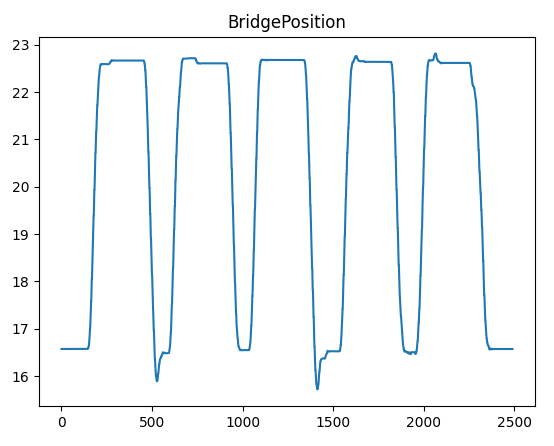
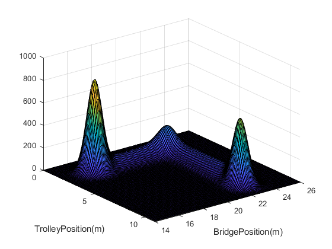
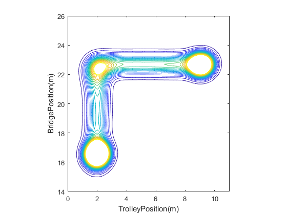

# Fuzzy Scripts
Fuzzy Scripts for Testing Fuzzy Modeling Method

## Description
This project is created for testing the fuzzy data modeling method presented in Tuomas Keski-Heikkilä's master's [thesis](http://urn.fi/URN:NBN:fi:aalto-202109059012).
A journal article of the method is currently under writing.

## Installation
For running this project Python 3 is required. Install the required packages by running 

    pip3 install -r requirements.txt

## Usage
You can generate test data using [generate_test_data.py](generate_test_data.py). At the beginning of the script there are several parameters that can be used to modify the data. You can also use [test_data_descriptions.txt](examples/test_data_descriptions.txt) to modify the gaussian functions used to generate data.

    python3 generate_test_data.py

After that you can run [fuzzy_modeling.py](fuzzy_modeling.py) to fuzzify data and write it into database using the method desribed in [Placeholder for article].

    python3 fuzzy_modeling.py

This script can visualize the fuzzy sets used for fuzzification.

In addition, raw data can be plotted.

If you want to visualize data, run first [expand_fuzzy_sets_for_visualization.py](expand_fuzzy_sets_for_visualization.py)

    python3 expand_fuzzy_sets_for_visualization.py

Then you can run MATLAB script [DataVisualization.m](DataVisualization.m) that produces that visulization based on fuzzified data. This is illustarted below for crane data.

See [Documentation](Documentation.md) for more accurate descriptions of the contents of this repository.

## Authors and acknowledgment
Riku Ala-Laurinaho

The author would like to thank Tuomas Keski-Heikkilä, Miika Valtonen and Juuso Autiosalo for their support.
The author would like to express his sincere gratitude to Innovaatiosäätiö.

## License
MIT

## Project status
Initial version published.